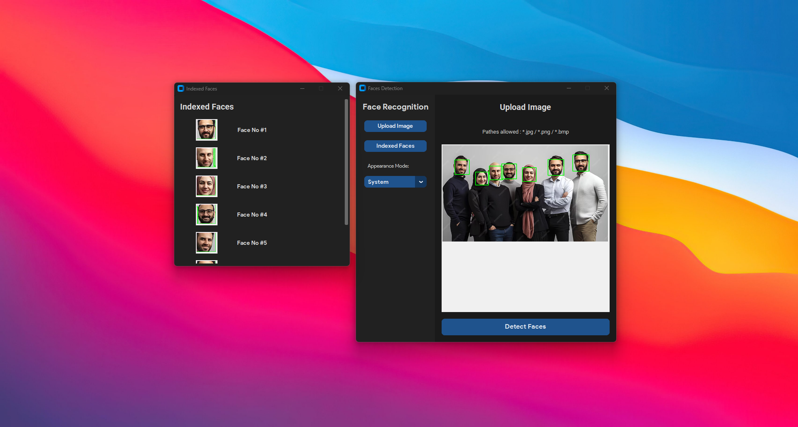

This project provides a graphical user interface (GUI) for face detection using Python, `customtkinter`, and `OpenCV`. The application allows users to upload images, detect faces, and view a list of detected faces with indexed display.



## Features

- **Modern GUI**: Built with `customtkinter` for a sleek and contemporary appearance.
- **Image Upload**: Supports image formats including `.jpg`, `.png`, and `.bmp`.
- **Face Detection**: Utilizes OpenCV’s Haar Cascade Classifier for accurate face detection.
- **Indexed Display**: Detected faces are shown with index numbers for easy identification.
- **Appearance Modes**: Choose between light, dark, and system default appearance modes.

## Requirements

- Python 3.x
- `customtkinter`
- `opencv-python`
- `Pillow`

## Installation

1. Clone the repository:
    ```bash
    git clone https://github.com/melgoharyme/face-detection-python-customtkinter.git
    cd face-detection-python-customtkinter
    ```

2. Install the required Python packages:
    ```bash
    pip install customtkinter opencv-python Pillow
    ```

## Usage

1. Run the script:
    ```bash
    python main.py
    ```

2. The GUI will launch. Upload an image by clicking "Upload Image".

3. Click "Detect Faces" to start face detection.

4. Detected faces will be displayed with index numbers, and rectangles will be drawn around each face in the image.

## Project Structure

- `main.py`: Contains the GUI and face detection logic.

## License

This project is licensed under The Unlicense. You are free to use, modify, and distribute this software for any purpose without restrictions.

## GUI Framework

The GUI framework used is `CustomTkinter`.

## Acknowledgments

Face detection is implemented using OpenCV’s Haar Cascade Classifier.